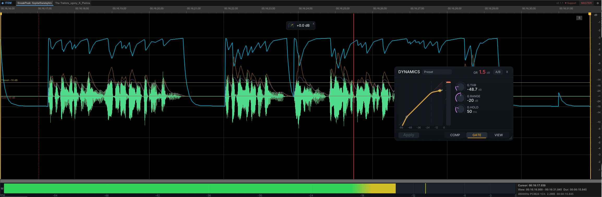
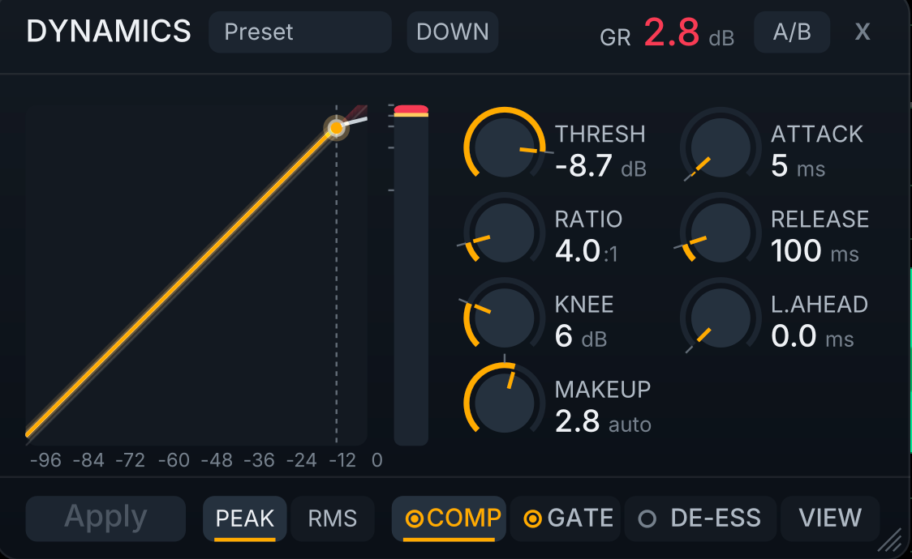
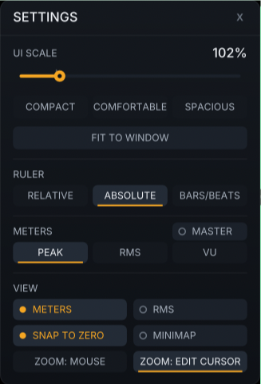

# SneakPeak

[](LICENSE)
[](https://github.com/b451c/SneakPeak/releases/latest)
[](#requirements)

**Precision waveform item editor for REAPER** - a native C++ extension that gives you a detailed, dockable waveform view for any media item. Click an item in REAPER's arrange view, and SneakPeak instantly shows you a full-featured waveform editor with dynamics processing, volume envelope editing, spectral analysis, multi-item layering, real-time metering, and full interface scaling (80-200%). Available for macOS (arm64/x86_64), Windows (x64), and Linux (x86_64/aarch64).



> *Select any audio item in REAPER and get an instant, detailed waveform with dynamics processing, volume envelope editing, spectral analysis, multi-item layering, and real-time metering - all in a dockable window. Above: the gate taming breaths between dialogue phrases, with threshold/gate lines, envelope automation and detector curves drawn live on the waveform.*

## Screenshots

<p align="center">
  
  
</p>
<p align="center"><i>The Dynamics panel (compressor tab) and the Settings panel - UI scale 80-200%, density presets, view preferences.</i></p>

<p align="center">
  
</p>
<p align="center"><i>Spectral view - async FFT spectrogram with frequency band selection.</i></p>

<details>
<summary><b>More demos (animated GIFs - click to expand)</b></summary>
<br>

**Standalone destructive editing** - drag & drop any file, edit, save:


**Multi-item layered view:**


**Fade handles with continuous curvature** (horizontal = length, vertical = shape):


**Minimap navigation:**


</details>

---

## Why SneakPeak?

REAPER is the most powerful DAW on the market, but a detailed waveform item editor has always been the one thing missing. SneakPeak fills that gap - a dedicated editor that lives inside REAPER as a native extension.

I looked everywhere for a solution - scripts, extensions, workarounds - but nothing delivered what I needed. So I built it. After months of development, I'm releasing SneakPeak as a free, open-source extension for the REAPER community. I considered making it paid, but ultimately decided that the community deserves access to tools like this without barriers.

If you find SneakPeak valuable, please consider [supporting its development](#support). Every contribution helps keep this project alive and growing.

---

## Features

SneakPeak has five viewing modes: **ITEM** (default - click any item), **Timeline View** (after cutting), **Multi-Item** (select 2+ items), **SET** (working set, press T), and **Standalone** (drag & drop files). All non-destructive editing goes through the REAPER API with full undo.

### Interface & Scaling (new in v2.2)
- **Global UI scale (80-200%)** - the entire interface scales from one slider: fonts, toolbar, ruler, meters, panels, and every click target. First run auto-detects your system DPI (Windows display scaling, Linux GDK scale).
- **Settings panel** - gear icon in the mode bar: UI scale with live preview, density presets (Compact / Comfortable / Spacious), Fit to Window, and the Ruler / Meters / View preferences.
- **Premium rendering** - anti-aliased, DPI-crisp Dynamics panel, Settings panel, gain knob, L/R meters and toasts.

### Waveform Display
- **Precision waveform rendering** - Peak + RMS display with dB scale and zero-crossing line.
- **Truthful clip display** - red marks real clipping (source flat-tops, or over-0dB in destructive Standalone mode); amber marks over-0dB warnings in REAPER's float contexts where nothing has clipped yet. A dark-red 0dB reference line appears when zoomed out vertically.
- **Deep zoom** - Horizontal and vertical zoom with scroll wheel, toolbar buttons, and keyboard. Zoom to fit, zoom to selection. Zoom anchors on the mouse position or the edit cursor (Settings > View).
- **Minimap** - Resizable overview bar showing the full item waveform. Click to navigate, drag to scroll.
- **Time ruler** - Dynamic tick intervals from milliseconds to minutes with position readout.
- **Channel solo (L/R)** - per-channel monitoring that keeps the soloed channel on its own side (take pan balance under the hood; your pan is saved and restored).

### Audio Editing
- **Precision selection** - Click and drag to select audio regions. Shift+click to extend. Double-click to select all.
- **Cut / Copy / Paste** - Full clipboard support with sample-accurate editing.
- **Normalize** - Peak normalization to 0 dB, plus LUFS normalization (-14 / -16 LUFS).
- **Fades** - Drag fade handles with continuous curvature control (horizontal = length, vertical = curve shape). 7 base shapes with smooth curvature matching REAPER's native D_FADEINDIR.
- **Reverse** - Reverse selection or full item.
- **Gain adjustment** - Interactive gain knob (+24 to -60 dB) with fine-adjust mode (Cmd+drag). Scroll wheel on knob for +/-0.5 dB. Quick +3/-3 dB from context menu.
- **DC offset removal** - One-click DC bias correction.
- **Silence / Insert silence** - Zero out selection or insert silence at cursor.
- **Snap to zero-crossing** - Intelligent selection boundaries at zero-crossing points.
- **Undo** - Full REAPER undo integration. Independent 20-level undo stack in standalone mode.

### Dynamics Processing
Right-click > Process > Dynamics Panel. SneakPeak auto-activates the take volume envelope if it isn't already enabled (no manual setup). Analyzes audio and writes volume envelope automation - zero CPU cost during playback.
- **Built-in compressor** - Industry-standard gain-smoothing architecture (ratio, threshold, soft knee, attack, release, auto makeup gain). Matches FabFilter Pro-C / Waves / ReaComp.
- **Noise gate** - Post-compression gate for breath reduction in speech/podcast. Threshold, range, hold parameters.
- **Lookahead** - 0-20ms transient detection without latency cost.
- **10-slider dynamics panel** - Inline control surface with real-time preview. Any slider change instantly updates the compression curves on the waveform.
- **Live mode** - Real-time envelope writing as you drag sliders. Waveform updates instantly, no Apply needed.
- **6 built-in presets** - Default, Gentle Leveling, Voice/Podcast, Broadcast, De-breath, Music Bus.
- **Per-item persistence** - Settings auto-saved via P_EXT, auto-loaded when reopening.
- **GR meter + shading** - Gain reduction visualization in panel and on waveform.
- **A/B bypass** - Instant before/after comparison (audio + visual).
- **Peak/RMS detection** - Toggle between peak and RMS analysis modes.

### Volume Envelope Editing
Enable via right-click > View > Show Volume Envelope. SneakPeak auto-activates the take volume envelope on the current item if it is not yet enabled in REAPER.
- **Envelope overlay** - Cyan curve showing take volume envelope, 1:1 with REAPER arrange view.
- **Point editing** - Click to add, drag to move, double-click or Delete to remove. Right-click for curve shape (6 shapes).
- **Multi-select** - Shift+click to toggle, batch drag/delete.
- **Freehand drawing** - Cmd+drag on envelope line to draw points continuously.
- **Selection rectangle** - Cmd+drag on empty area for rectangle selection.
- **Dense point interaction** - Reveal rectangle for managing >100 points after Apply Dynamics.
- **Works in all modes** - ITEM, Timeline, and SET modes via per-segment envelope lookup.

### Spectral Analysis
- **Real-time spectrogram** - Async FFT computation (2048-point) with magma color scheme.
- **Frequency selection** - Alt+drag to select frequency bands for visual isolation.
- **Per-channel display** - Stereo spectral view with stacked channels.

### Timeline View
Enters automatically after cutting an item in ITEM mode. Shows all fragments with gaps preserved. Exit by clicking a single item. Also accessible via the MULTI dropdown menu.
- **Post-cut continuity** - All surviving fragments shown with gaps preserved, matching the REAPER timeline 1:1. Dark background marks gap regions.
- **Repeated editing** - Continue cutting, adjusting gain, and editing within timeline view. Zoom position preserved across operations.
- **Auto lifecycle** - Enters automatically after cut, exits when you click a single item on REAPER timeline.
- **Option+click segment snap** - Option+click on any segment to instantly select its full range for gain adjustment without creating new splits.

### Multi-Item View
Select 2+ items in REAPER to enter automatically. Click the MULTI label for a dropdown to switch between Mix, Layered, and Timeline View.
- **Cross-track editing** - View all selected items together on an absolute timeline.
- **Mix mode** - Sum all items into a single waveform (like a folder track).
- **Layered mode (per Item)** - Each item displayed in a distinct color with transparency, overlaid on each other. 8-color palette for clear visual separation.
- **Layered mode (per Track)** - Items colored by their parent track for track-aware visualization.
- **Gap visualization** - Dark regions between items for clear visual context.
- **Cross-segment editing** - Delete and gain operations work across item boundaries.
- **Crossfade indicators** - Join-point lines at crossfade midpoints for easy visual reference.
- **Batch gain** - One knob adjusts relative gain across all selected items.

### Working Set (SET Mode)
Select items on one track, press T to enter. Gaps collapse into a continuous waveform. Press T again or Escape to exit.
- **Lock items for editing** - Persistent Working Set survives clicking elsewhere. Click any set item to restore.
- **Persistent state** - Click elsewhere and come back - the set auto-restores when you click any set item.
- **Non-destructive editing** - Delete, split, and gain operations work through REAPER API with full undo.
- **Ripple edit** - Delete in SET mode automatically pulls subsequent items left to close gaps.
- **Selection-aware gain** - Gain knob with selection splits at edges and applies D_VOL only to the fragment (with 10ms crossfade overlap).
- **Group Set Items** - Group all items in the set (or selected range) for easy timeline manipulation. Visual colored bar below ruler.
- **Absolute time ruler** - Toggle between relative and REAPER timeline time (context menu).
- **Bidirectional cursor sync** - Click in SneakPeak scrolls REAPER arrange, click on REAPER timeline updates SneakPeak playhead.

### Metering
- **Real-time level meters** - Stereo L/R display with peak hold indicators.
- **Three meter modes** (right-click to switch):
  - **Peak (PPM)** - True peak metering, instant attack, slow decay.
  - **RMS (AES/EBU)** - RMS loudness with 300ms integration window.
  - **VU** - Classic VU ballistics with slow attack and decay.
- **Info panel** - Selection bounds, view range, format details (sample rate, bit depth, channels, file size, duration).

### Standalone File Mode
Drag any audio file (WAV, MP3, FLAC) into the SneakPeak window to enter. Fully destructive editing with independent undo.
- **Drag & drop** files directly into SneakPeak for offline editing.
- **Multiple file tabs** - Up to 8 files open simultaneously with independent undo stacks.
- **Smart Save** - Ctrl+S with overwrite confirmation for WAV, auto `_edit.wav` for MP3/FLAC. Ctrl+Shift+S for Save As.
- **Replace Source in REAPER Timeline** - Right-click > Replace Source in REAPER Timeline after editing: one click saves the file and swaps `P_SOURCE` on every project take that references the original path. Immediate arrange redraw.
- **Drag-export** - Drag files to REAPER timeline. Clean files use original (no copy), dirty files auto-save first. Selections export as named WAV.

### Markers
- **Add markers** at cursor position (M key).
- **Add regions** from selection (Shift+M).
- **Edit / delete / drag** markers in the ruler.
- **Tab / Shift+Tab** to navigate between markers.

### Playback
- **Play from cursor** or play selection with REAPER transport.
- **Playhead follow** - Waveform auto-scrolls to follow playback position.
- **Standalone preview** - Play audio directly from standalone tabs.

### Integration
- **Floating or docked** - Starts as resizable floating window. Dock/undock via context menu ("Dock SneakPeak in Docker"). Position and size remembered across sessions.
- **Auto-follow selection** - Automatically loads the selected item when you click in the arrange view.
- **Drag export** - Drag a selection outside SneakPeak to place it on REAPER timeline. Alt+drag for immediate export to Finder.
- **Track solo** - Solo button (S) for quick track isolation.
- **REAPER markers** - Full integration with REAPER's project markers.
- **Persistent settings** - All preferences (meter mode, view mode, minimap, snap, dock state, RMS/meter visibility) survive REAPER restarts.
- **Check for updates** - Click the version label in the mode bar to query the latest release on GitHub.
- **Hide RMS / hide meters** - View menu toggles to show peak-only waveforms or give the waveform the full vertical space.

---

## Keyboard Shortcuts

| Action | Shortcut |
|--------|----------|
| Play / Pause | `Space` |
| Stop | `Escape` |
| Jump to start | `Home` |
| Jump to end | `End` |
| Next marker | `Tab` |
| Previous marker | `Shift+Tab` |
| Select all | `Ctrl/Cmd+A` |
| Undo | `Ctrl/Cmd+Z` |
| Cut | `Ctrl/Cmd+X` |
| Copy | `Ctrl/Cmd+C` |
| Paste | `Ctrl/Cmd+V` |
| Delete selection | `Delete` or `E` |
| Silence / Insert silence | `Ctrl/Cmd+Delete` |
| Normalize | `Ctrl/Cmd+N` |
| Toggle gain panel | `G` |
| Toggle Dynamics panel | `D` |
| Toggle Working Set | `T` |
| Add marker | `M` |
| Add region | `Shift+M` |
| Save (standalone) | `Ctrl/Cmd+S` |
| Save As (standalone) | `Ctrl/Cmd+Shift+S` |
| Split at cursor | `S` |
| Ripple Delete | `Shift+Delete` or `Shift+E` |
| Gain +/-1 dB | `Up` / `Down` |
| Next/Previous segment | `Alt/Option+Right/Left` |
| Zoom | `Scroll wheel` (anchor: mouse or edit cursor, see Settings) |
| Vertical zoom | `Shift+Scroll` or `Alt+Scroll` |
| Pan | `Ctrl/Cmd+Scroll` or `Middle-mouse drag` |
| Fine-adjust gain | `Ctrl/Cmd+drag` on knob |

---

## Installation

### ReaPack (recommended)

1. In REAPER, go to **Extensions > ReaPack > Import repositories...**
2. Paste this URL:
   ```
   https://raw.githubusercontent.com/b451c/SneakPeak/main/index.xml
   ```
3. Go to **Extensions > ReaPack > Browse packages**, search for **SneakPeak**.
4. Right-click > **Install**, then restart REAPER.

ReaPack will automatically notify you of future updates.

> **Troubleshooting:** if Synchronize packages does not show the latest version after a new release, check these in order:
> 1. **URL path** in **ReaPack > Manage repositories...** must contain `/main/`, not `/testing/`. Testing-branch URLs from alpha/beta periods serve an independent index that does not track production releases.
> 2. **Cache file mtime** - after Synchronize, `~/Library/Application Support/REAPER/ReaPack/Cache/SneakPeak.xml` (or your platform's equivalent) should be freshly updated. If it's stale, the download is silently failing to write (permissions, AV quarantine, disk). Remove and re-add the repo - this deletes and rewrites the cache file.
> 3. **Corporate proxy or AV** may strip `Cache-Control: no-cache` and serve a cached copy. Verify with `curl -H 'Cache-Control: no-cache' https://raw.githubusercontent.com/b451c/SneakPeak/main/index.xml` - should return the current index.
> 4. **Fresh release (<5 min ago)** - GitHub raw CDN (`raw.githubusercontent.com` via Fastly) returns `Cache-Control: max-age=300`. Wait 5 minutes and retry. Does not apply once more than 5 minutes have elapsed.

### Manual install

1. Download the binary for your platform from the [Releases](https://github.com/b451c/SneakPeak/releases/latest) page.
2. Copy it to your REAPER UserPlugins folder:

| Platform | File | Path |
|----------|------|------|
| **macOS arm64** | `reaper_sneakpeak-arm64.dylib` | `~/Library/Application Support/REAPER/UserPlugins/` |
| **macOS x86_64** | `reaper_sneakpeak-x86_64.dylib` | `~/Library/Application Support/REAPER/UserPlugins/` |
| **Windows x64** | `reaper_sneakpeak-x64.dll` | `%APPDATA%\REAPER\UserPlugins\` |
| **Linux x86_64** | `reaper_sneakpeak-x86_64.so` | `~/.config/REAPER/UserPlugins/` |
| **Linux aarch64** | `reaper_sneakpeak-aarch64.so` | `~/.config/REAPER/UserPlugins/` |

3. Restart REAPER.
4. Open via **Actions > SneakPeak: Toggle Window**, or assign a keyboard shortcut.

> **macOS note:** Only install one dylib - having both arm64 and x86_64 in UserPlugins will cause REAPER to load both and crash.

### Build from source

See [Building](#building) below.

---

## Usage

1. **Open SneakPeak** - Run "SneakPeak: Toggle Window" from REAPER's Actions menu (or assign a shortcut).
2. **Click any audio item** in REAPER's arrange view - SneakPeak instantly shows the detailed waveform.
3. **Click and drag** on the waveform to make a selection. Shift+click to extend.
4. **Right-click** anywhere for the full context menu - editing, processing, view options.
5. **Use the toolbar** for zoom, transport, and audio processing.
6. **Toggle spectral view** from the context menu (View > Spectral View).
7. **Select multiple items** to enter multi-item mode. Right-click > View > Multi-Item View to switch between Mix and Layered modes.
8. **Right-click the meter panel** (bottom) to switch between Peak, RMS, and VU metering.
9. **Drag a WAV file** onto the window to open it in standalone mode.
10. **Press G** to show the gain knob for non-destructive level adjustment.

---

## Building

### Prerequisites

- **CMake** 3.24+
- **C++17** compiler (Clang on macOS)
- **REAPER SDK** - clone into `sdk/`:
  ```bash
  git clone https://github.com/justinfrankel/reaper-sdk.git sdk
  ```
- **WDL** - clone into `WDL/`:
  ```bash
  git clone https://github.com/justinfrankel/WDL.git WDL
  ```

### Compile and install (macOS)

```bash
mkdir -p build && cd build
cmake .. -DCMAKE_BUILD_TYPE=Release
make -j$(sysctl -n hw.ncpu)
# install via a FRESH file (rm first): overwriting a dylib in place while REAPER
# has it mapped can trigger a codesigning crash on Apple Silicon
rm -f ~/Library/Application\ Support/REAPER/UserPlugins/reaper_sneakpeak.dylib
cp reaper_sneakpeak.dylib ~/Library/Application\ Support/REAPER/UserPlugins/
```

### Debug build

Debug builds enable verbose logging to `/tmp/sneakpeak_debug.log`:

```bash
cmake .. -DCMAKE_BUILD_TYPE=Debug
make -j$(sysctl -n hw.ncpu)
```

---

## Requirements

- **REAPER** 7.0+ (tested on 7.62+)

### Supported Platforms

| Platform | Architecture | Status |
|----------|-------------|--------|
| **macOS** | arm64 (Apple Silicon) | Stable (primary development) |
| **macOS** | x86_64 (Intel) | Stable |
| **Windows** | x64 | Stable |
| **Linux** | x86_64 | Stable |
| **Linux** | aarch64 | Stable |

All platforms built via GitHub Actions CI on every tagged release. The codebase is pure C++ on WDL/SWELL; the premium panel renderer (Blend2D, Zlib license) is fetched and statically linked at build time - the shipped binary remains a single self-contained file.

---

## Architecture

```
src/
  main.cpp                Entry point, REAPER API imports, action registration
  edit_view.h/cpp         Core: window lifecycle, timer, layout, message dispatch
  rendering.cpp           Paint routines, mode bar, ruler, dynamics curves, master waveform
  input_handling.cpp      Mouse, keyboard, toolbar, envelope editing dispatch
  audio_commands.cpp      Clipboard, undo, destructive editing, normalize, fade, reverse
  standalone_file.cpp     Standalone tab lifecycle, save/load/save-as, preview playback
  context_menu.cpp        Right-click menu construction and command dispatch
  drag_export.cpp         Drag & drop WAV export to timeline/desktop
  waveform_view.h/cpp     Waveform data, zoom, selection, envelope helpers, coordinates
  waveform_rendering.cpp  Peak computation, waveform + envelope drawing, dB scale, fades
  dynamics_engine.h/cpp   Compressor + gate computation (peak/RMS, attack/release, lookahead)
  dynamics_panel.h/cpp    Inline dynamics control panel (knobs, tabs, presets, Live mode)
  settings_panel.h/cpp    Settings overlay (UI scale, density presets, view preferences)
  ui_render.h/cpp         Blend2D premium renderers (panels, knobs, meters, toast)
  ui_theme.h              Premium UI design tokens (colors, type scale, layout constants)
  win32_utf8_unit.c       Windows-only TU wrapping WDL's UTF-8 Win32 API layer
  item_split_ops.h/cpp    SplitAndApplyGain helper for consistent gain across all modes
  toolbar.h/cpp           Button bar with zoom, transport, and editing actions
  audio_engine.h/cpp      WAV file I/O (16/24/32-bit float), REAPER source refresh
  audio_ops.h/cpp         Sample processing (normalize, fade, reverse, gain, DC remove)
  multi_item_view.h/cpp   Mix/Layered multi-item view, per-layer audio, absolute timeline
  spectral_view.h/cpp     Async FFT spectrogram with magma colormap
  minimap_view.h/cpp      Resizable minimap overview
  levels_panel.h/cpp      Peak/RMS/VU level meters with mode-dependent ballistics
  gain_panel.h/cpp        Interactive gain knob with fine-adjust mode
  marker_manager.h/cpp    REAPER marker integration (add, edit, delete, navigate)
  theme.h/cpp             Color palette, visual theming, cached fonts
  config.h                Layout constants, interaction parameters, shared utilities
  platform.h              Cross-platform abstraction (Win32/SWELL)
  globals.h/cpp           REAPER API function pointers and helpers
```

The extension loads full audio data via REAPER's AudioAccessor API for accurate waveform display and editing. The waveform uses double-buffered GDI rendering (smooth and flicker-free); the control panels, meters and toasts render through Blend2D for anti-aliased, DPI-crisp output at any UI scale.

---

## Contributing

Contributions are welcome! See [CONTRIBUTING.md](CONTRIBUTING.md) for guidelines.

Bug reports, feature requests, and cross-platform testing help are all appreciated. Please use [GitHub Issues](https://github.com/b451c/SneakPeak/issues) to report problems or suggest new features.

---

## Support

SneakPeak is free and open source. If you find it useful in your workflow, please consider supporting its development - it makes a real difference and helps keep the project alive:

- [Ko-fi](https://ko-fi.com/quickmd)
- [Buy Me a Coffee](https://buymeacoffee.com/bsroczynskh)
- [PayPal](https://paypal.me/b451c)

---

## License

[MIT](LICENSE) - Copyright (c) 2025-2026 b451c

## Links

- **Forum thread** - https://forum.cockos.com/showthread.php?t=307499
- **REAPER** - https://www.reaper.fm
- **ReaPack** - https://reapack.com
- **REAPER SDK** - https://github.com/justinfrankel/reaper-sdk
- **WDL/SWELL** - https://github.com/justinfrankel/WDL


---

Made by [falami.studio](https://falami.studio/lab/sneakpeak/) — audio production & engineering studio.
