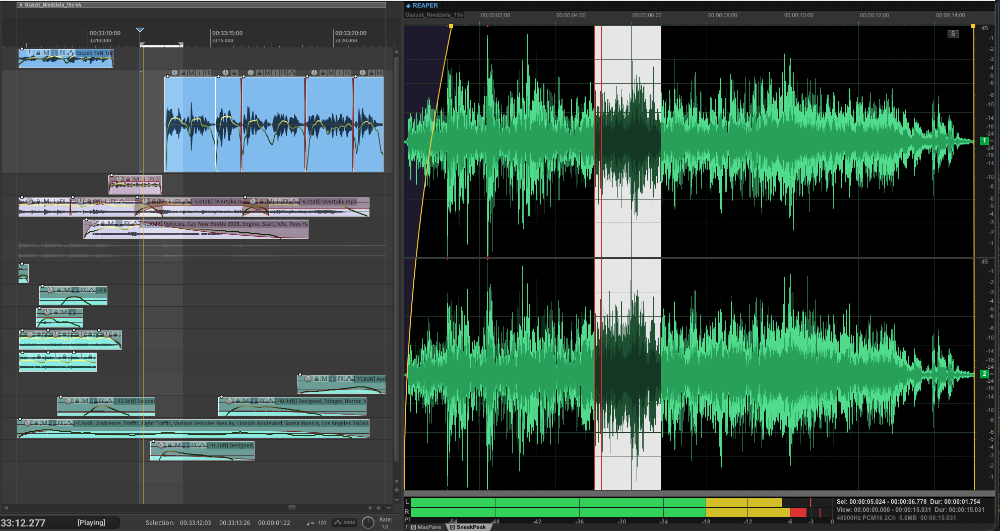
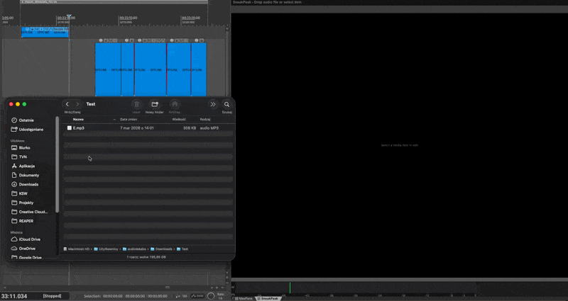
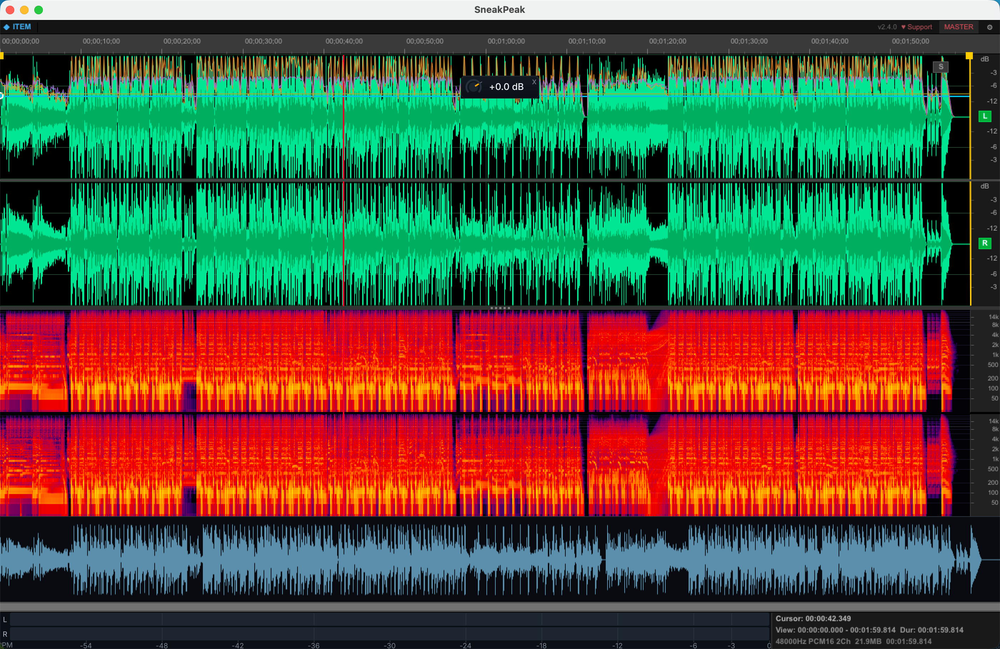

# SneakPeak

[](LICENSE)
[](https://github.com/b451c/SneakPeak/releases/latest)
[-brightgreen.svg)](#requirements)

**Precision waveform item editor for REAPER** - a native C++ extension that gives you a detailed, dockable waveform view for any media item. Click an item in REAPER's arrange view, and SneakPeak instantly shows you a full-featured waveform editor with spectral analysis, multi-item layering, and real-time metering.



> *Select any audio item in REAPER and get an instant, detailed waveform with selection, editing, spectral analysis, multi-item layering, and real-time metering - all in a dockable window.*

## Screenshots

| Standalone editing | Multi-item layered view |
|:---:|:---:|
|  |  |

| Spectral analysis | Minimap navigation |
|:---:|:---:|
|  |  |

| Fade handles with continuous curvature |
|:---:|
|  |

---

## Why SneakPeak?

REAPER is the most powerful DAW on the market, but a detailed waveform item editor has always been the one thing missing. SneakPeak fills that gap - a dedicated editor that lives inside REAPER as a native extension.

I looked everywhere for a solution - scripts, extensions, workarounds - but nothing delivered what I needed. So I built it. After months of development, I'm releasing SneakPeak as a free, open-source extension for the REAPER community. I considered making it paid, but ultimately decided that the community deserves access to tools like this without barriers.

If you find SneakPeak valuable, please consider [supporting its development](#support). Every contribution helps keep this project alive and growing.

---

## Features

### Waveform Display
- **Precision waveform rendering** - Peak + RMS display with dB scale, clip indicators, and zero-crossing line.
- **Deep zoom** - Horizontal and vertical zoom with scroll wheel, toolbar buttons, and keyboard. Zoom to fit, zoom to selection.
- **Minimap** - Resizable overview bar showing the full item waveform. Click to navigate, drag to scroll.
- **Time ruler** - Dynamic tick intervals from milliseconds to minutes with position readout.
- **Channel controls** - Per-channel visibility (L/R mute buttons), mono downmix toggle.

### Audio Editing
- **Precision selection** - Click and drag to select audio regions. Shift+click to extend. Double-click to select all.
- **Cut / Copy / Paste** - Full clipboard support with sample-accurate editing.
- **Normalize** - Peak normalization to 0 dB, plus LUFS normalization (-14 / -16 LUFS).
- **Fades** - Drag fade handles with continuous curvature control (horizontal = length, vertical = curve shape). 7 base shapes with smooth curvature matching REAPER's native D_FADEINDIR.
- **Reverse** - Reverse selection or full item.
- **Gain adjustment** - Interactive gain knob (+12 to -60 dB) with fine-adjust mode (Cmd+drag). Quick +3/-3 dB from context menu.
- **DC offset removal** - One-click DC bias correction.
- **Silence / Insert silence** - Zero out selection or insert silence at cursor.
- **Snap to zero-crossing** - Intelligent selection boundaries at zero-crossing points.
- **Undo** - Full REAPER undo integration. Independent 20-level undo stack in standalone mode.

### Spectral Analysis
- **Real-time spectrogram** - Async FFT computation (2048-point) with magma color scheme.
- **Frequency selection** - Alt+drag to select frequency bands for visual isolation.
- **Per-channel display** - Stereo spectral view with stacked channels.

### Multi-Item View
- **Cross-track editing** - Select 2+ items in REAPER and view them together on an absolute timeline.
- **Mix mode** - Sum all items into a single waveform (like a folder track).
- **Layered mode (per Item)** - Each item displayed in a distinct color with transparency, overlaid on each other. 8-color palette for clear visual separation.
- **Layered mode (per Track)** - Items colored by their parent track for track-aware visualization.
- **Crossfade indicators** - Join-point lines at crossfade midpoints for easy visual reference.
- **Batch gain** - One knob adjusts relative gain across all selected items.

### Metering
- **Real-time level meters** - Stereo L/R display with peak hold indicators.
- **Three meter modes** (right-click to switch):
  - **Peak (PPM)** - True peak metering, instant attack, slow decay.
  - **RMS (AES/EBU)** - RMS loudness with 300ms integration window.
  - **VU** - Classic VU ballistics with slow attack and decay.
- **Info panel** - Selection bounds, view range, format details (sample rate, bit depth, channels, file size, duration).

### Standalone File Mode
- **Drag & drop WAV files** directly into SneakPeak for offline editing.
- **Multiple file tabs** - Up to 8 files open simultaneously with independent undo stacks.
- **Smart Save** - Ctrl+S with overwrite confirmation for WAV, auto `_edit.wav` for MP3/FLAC. Ctrl+Shift+S for Save As.
- **Drag-export** - Drag files to REAPER timeline. Clean files use original (no copy), dirty files auto-save first. Selections export as named WAV.

### Markers
- **Add markers** at cursor position (M key).
- **Add regions** from selection (Shift+M).
- **Edit / delete / drag** markers in the ruler.
- **Tab / Shift+Tab** to navigate between markers.

### Playback
- **Play from cursor** or play selection with REAPER transport.
- **Playhead follow** - Waveform auto-scrolls to follow playback position.
- **Standalone preview** - Play audio directly from standalone tabs.

### Integration
- **Dockable window** - Docks into REAPER's native docker system.
- **Auto-follow selection** - Automatically loads the selected item when you click in the arrange view.
- **Track solo** - Solo button (S) for quick track isolation.
- **REAPER markers** - Full integration with REAPER's project markers.
- **Persistent settings** - All preferences (meter mode, view mode, minimap, snap) survive REAPER restarts.

---

## Keyboard Shortcuts

| Action | Shortcut |
|--------|----------|
| Play / Pause | `Space` |
| Stop | `Escape` |
| Jump to start | `Home` |
| Jump to end | `End` |
| Next marker | `Tab` |
| Previous marker | `Shift+Tab` |
| Select all | `Ctrl/Cmd+A` |
| Undo | `Ctrl/Cmd+Z` |
| Cut | `Ctrl/Cmd+X` |
| Copy | `Ctrl/Cmd+C` |
| Paste | `Ctrl/Cmd+V` |
| Delete selection | `Delete` or `E` |
| Silence / Insert silence | `Ctrl/Cmd+Delete` |
| Normalize | `Ctrl/Cmd+N` |
| Toggle gain panel | `G` |
| Add marker | `M` |
| Add region | `Shift+M` |
| Save (standalone) | `Ctrl/Cmd+S` |
| Save As (standalone) | `Ctrl/Cmd+Shift+S` |
| Split at cursor | `S` |
| Zoom | `Scroll wheel` |
| Vertical zoom | `Shift+Scroll` or `Alt+Scroll` |
| Pan | `Ctrl/Cmd+Scroll` |
| Fine-adjust gain | `Ctrl/Cmd+drag` on knob |

---

## Installation

### ReaPack (recommended)

1. In REAPER, go to **Extensions > ReaPack > Import repositories...**
2. Paste this URL:
   ```
   https://raw.githubusercontent.com/b451c/SneakPeak/main/index.xml
   ```
3. Go to **Extensions > ReaPack > Browse packages**, search for **SneakPeak**.
4. Right-click > **Install**, then restart REAPER.

ReaPack will automatically notify you of future updates.

### Manual install

1. Download the binary for your platform from the [Releases](https://github.com/b451c/SneakPeak/releases/latest) page.
2. Copy it to your REAPER resource path:

| Platform | Path |
|----------|------|
| **macOS** | `~/Library/Application Support/REAPER/UserPlugins/` |

3. Restart REAPER.
4. Open via **Actions > SneakPeak: Toggle Window**, or assign a keyboard shortcut.

### Build from source

See [Building](#building) below.

---

## Usage

1. **Open SneakPeak** - Run "SneakPeak: Toggle Window" from REAPER's Actions menu (or assign a shortcut).
2. **Click any audio item** in REAPER's arrange view - SneakPeak instantly shows the detailed waveform.
3. **Click and drag** on the waveform to make a selection. Shift+click to extend.
4. **Right-click** anywhere for the full context menu - editing, processing, view options.
5. **Use the toolbar** for zoom, transport, and audio processing.
6. **Toggle spectral view** from the context menu (View > Spectral View).
7. **Select multiple items** to enter multi-item mode. Right-click > View > Multi-Item View to switch between Mix and Layered modes.
8. **Right-click the meter panel** (bottom) to switch between Peak, RMS, and VU metering.
9. **Drag a WAV file** onto the window to open it in standalone mode.
10. **Press G** to show the gain knob for non-destructive level adjustment.

---

## Building

### Prerequisites

- **CMake** 3.15+
- **C++17** compiler (Clang on macOS)
- **REAPER SDK** - clone into `sdk/`:
  ```bash
  git clone https://github.com/justinfrankel/reaper-sdk.git sdk
  ```
- **WDL** - clone into `WDL/`:
  ```bash
  git clone https://github.com/justinfrankel/WDL.git WDL
  ```

### Compile and install (macOS)

```bash
mkdir -p build && cd build
cmake .. -DCMAKE_BUILD_TYPE=Release
make -j$(sysctl -n hw.ncpu)
cp reaper_sneakpeak.dylib ~/Library/Application\ Support/REAPER/UserPlugins/
```

### Debug build

Debug builds enable verbose logging to `/tmp/sneakpeak_debug.log`:

```bash
cmake .. -DCMAKE_BUILD_TYPE=Debug
make -j$(sysctl -n hw.ncpu)
```

---

## Requirements

- **REAPER** 7.0+ (tested on 7.62)
- **macOS** arm64 (Apple Silicon) - **stable, fully functional**

### Planned platforms

- **Windows** x64 - planned for a future release
- **Linux** x86_64 - planned for a future release

The codebase is built on WDL/SWELL for cross-platform portability. Windows and Linux support is architecturally ready and will be available in a future version. If you're interested in helping with cross-platform testing, please reach out via [GitHub Issues](https://github.com/b451c/SneakPeak/issues).

---

## Architecture

```
src/
  main.cpp              Entry point, REAPER API imports, action registration
  edit_view.h/cpp       SneakPeak window class, context menu, clipboard, destructive editing
  waveform_view.h/cpp   Peak rendering, zoom, selection, coordinate conversion
  toolbar.h/cpp         Button bar with zoom, transport, and editing actions
  audio_engine.h/cpp    WAV file I/O (16/24/32-bit float), REAPER source refresh
  audio_ops.h/cpp       Sample processing (normalize, fade, reverse, gain, DC remove)
  multi_item_view.h/cpp Mix/Layered multi-item view, per-layer audio, absolute timeline
  spectral_view.h       Async FFT spectrogram with magma colormap
  minimap_view.h        Resizable minimap overview
  levels_panel.h/cpp    Peak/RMS/VU level meters with mode-dependent ballistics
  gain_panel.h          Interactive gain knob with fine-adjust mode
  marker_manager.h      REAPER marker integration (add, edit, delete, navigate)
  theme.h               Color palette and visual theming
  config.h              Layout constants and interaction parameters
  platform.h            Cross-platform abstraction (Win32/SWELL)
  globals.h/cpp         REAPER API function pointers and helpers
```

The extension loads full audio data via REAPER's AudioAccessor API for accurate waveform display and editing. Double-buffered GDI rendering ensures smooth, flicker-free display.

---

## Contributing

Contributions are welcome! See [CONTRIBUTING.md](CONTRIBUTING.md) for guidelines.

Bug reports, feature requests, and cross-platform testing help are all appreciated. Please use [GitHub Issues](https://github.com/b451c/SneakPeak/issues) to report problems or suggest new features.

---

## Support

SneakPeak is free and open source. If you find it useful in your workflow, please consider supporting its development - it makes a real difference and helps keep the project alive:

- [Ko-fi](https://ko-fi.com/quickmd)
- [Buy Me a Coffee](https://buymeacoffee.com/bsroczynskh)
- [PayPal](https://paypal.me/b451c)

---

## License

[MIT](LICENSE) - Copyright (c) 2025-2026 b451c

## Links

- **Forum thread** - https://forum.cockos.com/showthread.php?t=307499
- **REAPER** - https://www.reaper.fm
- **ReaPack** - https://reapack.com
- **REAPER SDK** - https://github.com/justinfrankel/reaper-sdk
- **WDL/SWELL** - https://github.com/justinfrankel/WDL
